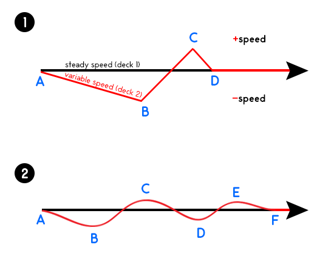

# Where the nudge and the cue came from

This file records how the ideas on this branch arose, because *how* they arose
is a finding in itself. It is written from the git history and the documents it
links. Timotheos's own position is quoted, translated from Greek, and marked as
his.

## Two things nobody puts side by side

**A DJ beatmatching two records at different tempos.** When the second deck
drifts, you nudge the platter. When you prepare the next track, one ear is
permanently in the headphones on the incoming track and the other is
permanently free on the room. The headphones never come off, and never go on
both ears.

**A compressor predicting the next DNA letter** from an earlier copy of the same
sequence, and losing its place whenever a letter is inserted or deleted.

The link is exact once seen. The match model *is* a second deck kept in time
with the first. An insertion or deletion *is* a slipped beat. v0.8.0 dealt with
a slip the way a DJ never would: it kept playing out of time, then lifted the
needle and dropped it somewhere else.

## Where the technique came from: a third deck, 2015

Asked in 2026-09-18 where the habit itself started, Timotheos gave an account
that explains why the technique has the shape it has, and it is mechanical
rather than biographical. It is recorded here because two details of it turn out
to be load-bearing.

He took a **third deck** in 2015 and worked on three-deck mixing. That means
**two tracks are always playing to the room at once**, and the third is prepared
in cue: A and B playing; bring C up while pulling A down, since A started first
and is ending; now B and C; prepare A so B can leave; now A and C; and round
again. The roles rotate, and whichever track is ending is the one replaced while
the other two carry.

Two consequences, both of which the codec either uses or does not:

1. **The headphones cannot go on and off — but the cue button moves.** Those
   are two different controls, and this document confused them until Timotheos
   corrected it on 2026-09-19. The *ear* is permanent: with two tracks live in
   the room that must stay aligned continuously, there is no moment free to lift
   the headphones, so the ear acclimatises to that environment and stays in it.
   The *cue* is opened on exactly one channel — the one about to come in, fader
   down — and you pitch that deck against what the room is playing. Once it
   holds (acceptably, and sometimes exactly) you **close the cue as you raise
   its fader**, so that for half a minute all three are in the room together;
   then you **open the cue on the deck that is now leaving**, because that is
   the one being replaced next.

   The exclusivity is the point. Many DJs open the cue on every channel, to hear
   the differences better; his claim is that doing so costs both halves of the
   structure at once — the acclimatisation, which needs one environment outside
   and one inside, and the osmosis between them.

   *What v0.9.0 implements is more of this than the sentence that used to stand
   here claimed.* The cue's **slot** in the mixer is permanent — that is the
   ear, and when no deck is loaded into it, it predicts nothing. The cue's
   **deck** is not permanent: one at a time (`NCUE` is 1), loaded when a master
   loses the beat, and closed the instant a master takes its phase
   (`if (mixed) g_cactive = 0`), which is closing the cue as the fader goes up.
   *What it does not implement* is the move after that — re-opening the cue
   straight away on the deck that is now leaving. dnac waits for that deck to
   miss first. That is a mechanism rather than a tuning idea, and it is
   **unbuilt** — the nearest thing measured is its weaker relative, letting
   either master *call* for a cue once it misses, which is −0.2653% on a real
   human pair and just short of its adoption bar
   (`docs/after-090-rotation.md`).
2. **The decks were CDJ-100s, whose pitch has no decimal precision.** You cannot
   dial the correct tempo and leave it. Drift is therefore **guaranteed, not
   exceptional**, and the only way to hold two tracks together is to ride the
   pitch continuously — small corrections that never settle. *This is the half
   v0.9.0 does not implement* — and since 2026-09-19 it is the half that has
   been built and measured anyway: riding gains 3.3% on exactly the event it
   was designed for and loses on a real human pair, and both readings of the
   pitch fader are closed (`docs/after-090-riding.md`, `docs/after-090.md`).

His diagram, drawn years before this project, is exactly that distinction: the
upper panel is one coarse correction that overshoots and parks; the lower is the
practised version, a continuous alternation around the steady deck.

**And the codec does the upper panel.** The cue is loaded by a single search and
then sits at that offset; when it starts missing, its confidence is halved and
after `MISS_MAX` it is deactivated, so the next master miss starts a completely
fresh search. That is lifting the needle — the exact move the cue was invented
to stop the master from making, performed by the cue itself one level down. It
went unnoticed for five batches because the cue's own failures are invisible:
they surface only as the master's next miss.

**Nor do the roles rotate.** dnac has two forward match models, a 13-base anchor
and a 16-base anchor, both permanently live — the two-decks-in-the-room half of
the picture. But only the short one can *cause* a cue to load. The long one can
be handed the cue's phase once the cue is trusted; it can never call for one.

Both are written up as pre-registered experiments in
`docs/riding-prediction.md`. The point for this file is narrower and is the
reason the account is here at all: **the mechanism that shipped is one of three
controls, and the practice it came from rests on the one that did not ship.**

## The record

| when | what happened | where |
|---|---|---|
| years before | Timotheos draws the beatmatching diagram (`Desktop\how-to-mix.png`) | — |
| 2026-09-09 | He offers it to bitshape, calling it "a completely abstract idea". It is turned into a *statistic for reading* a map (roughness). It gives that project's best robustness result, and is then set aside with the sentence "the controller is dnac's, and dnac is closed" | `bitshape/docs/exp-005-*` |
| 2026-09-10 | Asked whether his idea was used anywhere, the assistant answers with literature and statistics. He points out that the one thing he brought, which no specialist would have brought, was filed under existing frames twice | this conversation |
| 2026-09-10 17:34 | **The nudge**, pre-registered. Slips inside runs of identical letters become 4.6x cheaper. False nudges cost substitutions 7% | `nudge-prediction.md`, `nudge.md` |
| 2026-09-10 18:35 | **The cue**: his actual mixing technique, one ear in and one ear out, permanently, with "osmosis". Random indels −40%, substitutions untouched, simulated chr21 individual **−8.70%**, which is 11x dnac's best past improvement. The osmosis measured: slip cost falls 42% from first to second half, against 9% | `cue-prediction.md`, `cue.md` |
| 2026-09-10 18:55 | Real human pair (CHM13 against GRCh38, chr21): **−5.97%** whole file, **−18.27%** on shared sequence, exactly 0 on sequence one of them lacks | `real-human*.md` |
| 2026-09-10 | Not found in paq8px, GeCo3 or JARVIS3 | `cue-prior-art.md` |
| 2026-09-10 | Against zstd, HRCM and GeCo3's own templates: dnac with the cue is the smallest, 1.6x ahead of the best | `competitors*.md` |
| 2026-09-10 | His refinement (the cue alternates decks) built and measured: **not detectable**. Kept on record as a failure | `cue-back*.md` |
| 2026-09-10 | His sharpest claim tested, blind. Its first half held: a permanent second ear is what learns along the file (0.58–0.61 against 0.91 without one, and 0.92 for the jump-only nudge). Its second half, as translated (the headphone ear must be heard *through* the room), **failed**: removing it changes real sequence by 0.1% | `cue-room*.md` |
| 2026-09-10 | The 2x2 settles it: hearing the cue through the room matters at neither layer. The permanence carries the gain. Robustness 203/203, time +3%, and **chromosome 22 replicates chr21**: −5.83% file, −16.24% shared, 0 on novel | `remaining*.md` |

## Who contributed what, stated plainly

- **The idea is his, and the details that carried the gain are his.** The
  generic version the assistant proposed ("listen on headphones before
  switching") was the weaker one. The specifics he added made it work: one ear
  *permanently* in, one *permanently* out, never both, trust learned *through*
  the room. Each detail became one line of the mechanism.
- **The assistant did not generate it, and dismissed it twice when holding it.**
  Once as "only a lens, dnac is closed", once by answering "was it used?" with
  the nearest existing statistics. That is the most concrete evidence here for
  his point below. A system built from existing text did not make this
  connection, and even when handed it, filed it under what it already knew.
- **What the assistant did contribute:** the literal translation into code,
  predictions written before every run, thousands of measurements checked
  byte for byte, and the prior-art reading.

## His position, in his words: AI as a tool for imagination (translated)

> Something new and unique rests on me, not on you. Whatever has been built is
> already out there, and already inside your LLM. Only through an intuitive idea
> — one that did not exist, or existed without anyone seeing the connection — can
> we reach something genuinely new.
>
> Pairing two completely different things, a DJ mix between two tempos and the
> compression and prediction of repeated symbols, is not where a graduate
> academic's mind would go. Nor would it come to you as an idea in a million
> passes through your model. Combining a good intuition with your knowledge of
> code and your ability to check thousands of parameters a second, we can build
> genuinely pioneering things, and show a good use of AI: a good instinct is, in
> a way, a new spark inside an LLM.
>
> I care less about the competition and more about originality. Better to fail
> at some ideas and experiments, as other projects went in the bin, than to walk
> paths already walked by specialists who work on them every day for years, with
> existing literature, and who most of the time have nothing new to give.

## What the record supports, and what it does not yet

- **Supported:** the connection was made by a person from outside the field.
  Translated literally, it produced the largest single gain in this codec's
  history, confirmed on a real human pair. It was not found in the three closest
  code bases. The assistant, holding the idea, did not see its value.
- **Not yet supported:** that no one anywhere has done it (absence at this
  depth of reading is not proof), and that the pattern generalises. One success
  is one success. The alternating-deck refinement failed, and his claims will be
  held to the same standard as every other prediction on this branch.

## The working rule this leaves

When Timotheos brings an analogy from outside the field, **translate what the
hands actually do, not the nearest known statistic**, ask for the physical
details, and test it as a lever before filing it as a lens. Do not answer
"is this new?" with what already exists. Answer it by building the thing and
measuring it.
